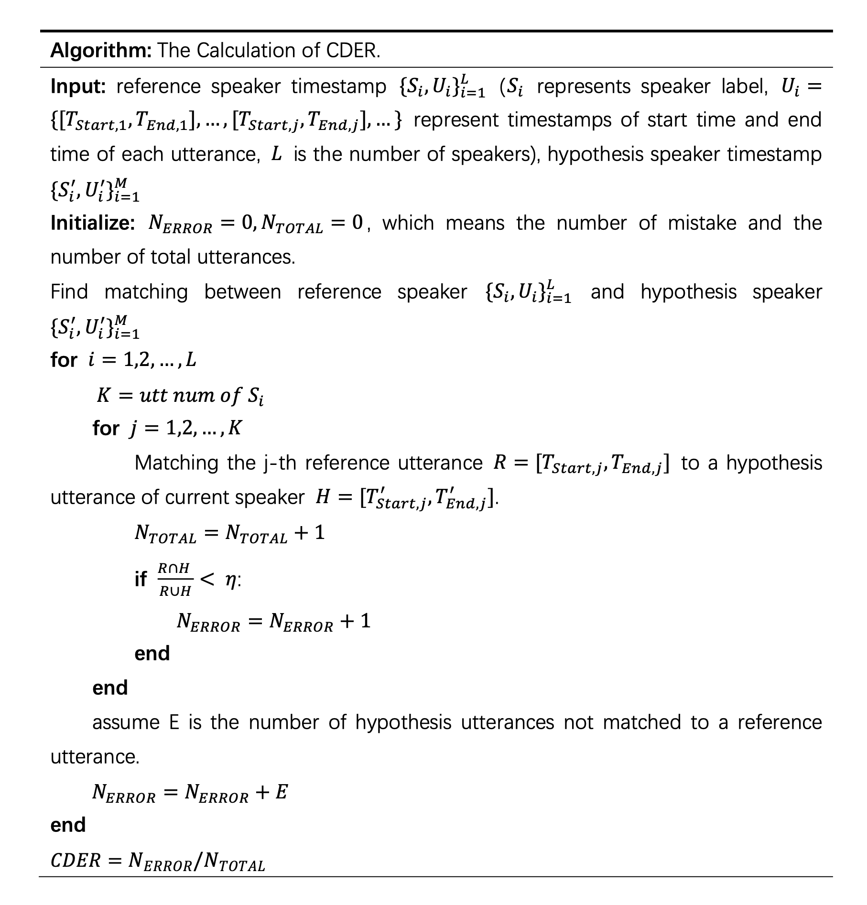

# CDER-Metric (Conversational Diarization Error Rate Metric)

- [Contents](#contents)
    - [Description](#description)
    - [Usage](#usage)
    - [Requirements](#requirements)
    - [Detail](#detail)
    - [Example](#example)
    - [Citation](#citation)
    - [Contact](#contact)
    - [Reference](#reference)

***
## [Description](#contents)
DER can reasonably evaluate the overall performance of the speaker diarization system on the time duration level. However, in real conversations, there are cases that a shorter duration contains vital information. The evaluation of the speaker diarization system based on the time duration is difficult to reflect the recognition performance of short-term segments. Our basic idea is that for each speaker, regardless of the length of the spoken sentence, all type of mistakes should be equally reflected in the final evaluation metric. Based on this, we intend to evaluate the performance of the speaker diarization system on the sentence level under conversational scenario (utterance level). We adopt Conversational-DER (CDER) to evaluate the speaker diarization system.

***
## [Usage](#contents)

Both the reference and hypothesis(system) should be saved in RTTM (Rich Transcription Time Marked) format.

```bash
python3 score.py -s hypothesis_rttm_path -r reference_rttm_path
```

***
## [Requirements](#requirements)

```bash
numpy
pyannote.core
```

***
## [Detail](#detail)

For CDER (Conversational Diarization Error Rate) calculation, we will firstly merge the utterances from the same person. For example, assuming $A_i$ represents the i-th utterance from speaker $A$, and $NS$ represents non-speech segments, $A_1,NS,A_2,NS,B_1,A_3,A_4,B_2,A_5,C_1$ will be merge to $A_1^{'},B_1^{'},A_3^{'},B_2^{'},A_5^{'},C_1^{'}$. The merged utterance ($A_1^{'}$) would preserve the timestamps of the start time of the first utterances ($A_1$) and the end time of the last utterances ($A_2$). Then, we will match each reference utterance to a hypothesis utterance. And we will compare the reference utterance with the matched hypothesis utterance to judge whether the prediction is correct or wrong. Finally we will calculate the CDER. The more specific algorithm is following.

<div align=center>

</div>

***
## [Example](#example)
We use CDER to evalate speaker diarization result of our [MagicData-RAMC baseline](https://github.com/MagicHub-io/MagicData-RAMC).

```bash
python3 score.py -s ./magicdata_rttm_pre -r ./rttm_gt_test
CTS-CN-F2F-2019-11-15-1421 CDER = 0.198
CTS-CN-F2F-2019-11-15-1422 CDER = 0.356
CTS-CN-F2F-2019-11-15-1423 CDER = 0.242
CTS-CN-F2F-2019-11-15-1426 CDER = 0.314
CTS-CN-F2F-2019-11-15-1428 CDER = 0.246
CTS-CN-F2F-2019-11-15-1434 CDER = 0.173
CTS-CN-F2F-2019-11-15-1447 CDER = 0.169
CTS-CN-F2F-2019-11-15-1448 CDER = 0.206
CTS-CN-F2F-2019-11-15-1449 CDER = 0.213
CTS-CN-F2F-2019-11-15-1452 CDER = 0.187
CTS-CN-F2F-2019-11-15-1458 CDER = 0.293
CTS-CN-F2F-2019-11-15-1461 CDER = 0.214
CTS-CN-F2F-2019-11-15-1463 CDER = 0.184
CTS-CN-F2F-2019-11-15-1468 CDER = 0.154
CTS-CN-F2F-2019-11-15-1469 CDER = 0.230
CTS-CN-F2F-2019-11-15-1470 CDER = 0.275
CTS-CN-F2F-2019-11-15-1473 CDER = 0.203
CTS-CN-F2F-2019-11-15-1475 CDER = 0.852
CTS-CN-F2F-2019-11-15-1477 CDER = 0.404
Avg CDER : 0.269
```

The relationship between CDER and DER on the speaker diarization result of [MagicData-RAMC baseline](https://github.com/MagicHub-io/MagicData-RAMC) is following.

<div align=center>

</div>


***
## [Citation](#contents)

If you use cder in your paper，please kindly consider citing our upcoming CDER description paper (will appear in iscslp 2022).

If you use MagicData-RAMC dataset in your research, please kindly consider citing our paper:

    @article{yang2022open,
    title={Open Source MagicData-RAMC: A Rich Annotated Mandarin Conversational (RAMC) Speech Dataset},
    author={Yang, Zehui and Chen, Yifan and Luo, Lei and Yang, Runyan and Ye, Lingxuan and Cheng, Gaofeng and Xu, Ji and Jin, Yaohui and Zhang, Qingqing and Zhang, Pengyuan and others},
    journal={arXiv preprint arXiv:2203.16844},
    year={2022}
    }


***
## [Contact](#contents)

If you have any questions, please contact us. You could open an issue on github or email us.

| Authors       | Email                                                               |
|---------------|---------------------------------------------------------------------|
| Gaofeng Cheng | [chenggaofeng@hccl.ioa.ac.cn](mailto:chenggaofeng@hccl.ioa.ac.cn)   |
| Yifan Chen    | [chenyifan@hccl.ioa.ac.cn](mailto:chenyifan@hccl.ioa.ac.cn)         |
| Runyan Yang   | [yangrunyan@hccl.ioa.ac.cn](mailto:yangrunyan@hccl.ioa.ac.cn)       |
| Qingxuan Li   | [liqx20@mails.tsinghua.edu.cn](mailto:liqx20@mails.tsinghua.edu.cn) |


***
## [Reference](#contents)

[1] NIST. (2009). The 2009 (RT-09) Rich Transcription Meeting Recognition Evaluation Plan. https://web.archive.org/web/20100606041157if_/http://www.itl.nist.gov/iad/mig/tests/rt/2009/docs/rt09-meeting-eval-plan-v2.pdf

[2] Ryant, N., Church, K., Cieri, C., Du, J., Ganapathy, S. and Liberman, M., 2020. Third DIHARD challenge evaluation plan. arXiv preprint arXiv:2006.05815.
